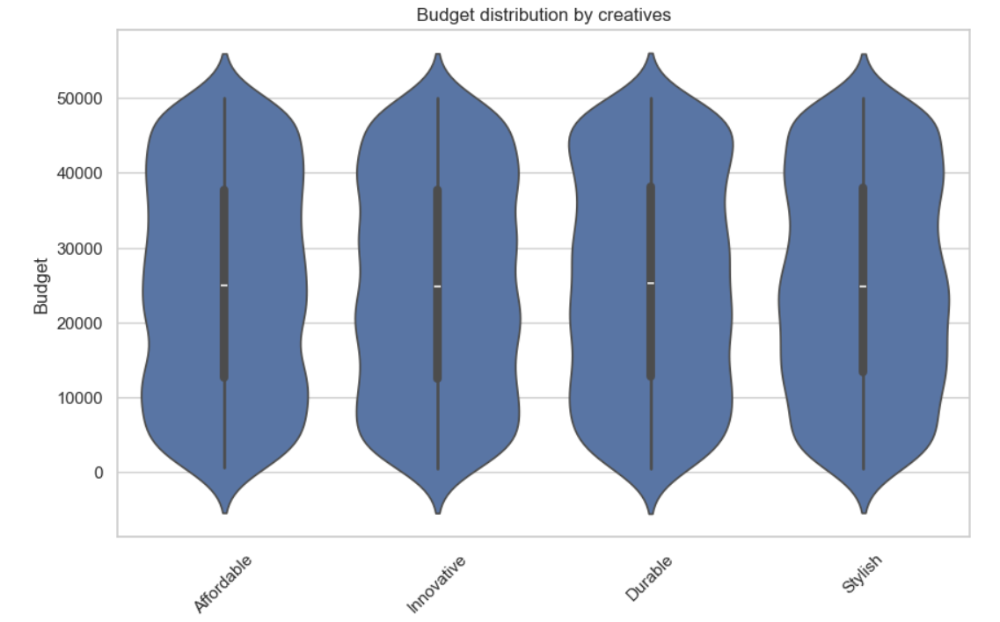

## Marketing Creatives Analysis

Analyze the impact of different marketing creatives on campaign performance metrics such as ROI, conversions, and customer satisfaction.
Tools: Python, Pandas, Seaborn, Plotly.
Focus: actionable insights for marketing strategy and creative optimization.
This project analyzes the performance of marketing creatives using data-driven metrics and machine learning. The main focus is to understand which creative ideas ("Common_Keywords") drive better ROI, conversions, cost-efficiency, and customer satisfaction.

---

### Goals

- Identify which creatives (keywords like "Affordable", "Stylish") yield the best ROI and ROAS
- Understand how creatives influence conversion rate (CVR), cost-per-click (CPC), and cost-per-acquisition (CPA)
- Detect which creatives are associated with high revenue and units sold
- Evaluate customer satisfaction per creative idea
- Use machine learning models to predict performance metrics like Conversions, Clicks, and Average Check

---

### Dataset Overview

- **Key Columns:** `Budget`, `Clicks`, `Conversions`, `Revenue_Generated`, `ROI`, `Common_Keywords`, `Customer_Satisfaction_Post_Refund`, etc.
- **New Metrics Created:**
  - `ROAS = Revenue_Generated / Budget`
  - `Revenue_per_Unit = Revenue_Generated / Units_Sold`
  - `CVR = Conversions / Clicks`
  - `CPA = Budget / Conversions`
  - `CPC = Budget / Clicks`

---

## Project Structure
- `creative_analysys/`: All Jupyter Notebook analysis
- `data/`: Source data file (`marketing_and_product_performance.csv`)
- `images/`: Visualizations referenced in this report

To run locally:
1. Open the Jupyter notebook inside `notebooks/`
2. Ensure data file is located at `data/marketing_and_product_performance.csv`
3. Run all cells to regenerate visuals and insights

---

### Insights (see images folder for plots)

#### 1. ROI and ROAS by Creative
-

Violinplots and boxplots show very similar ROI distributions across creatives (median ~2.7–2.8), suggesting limited variation in pure ROI.
However, "Stylish" and "Affordable" stand out in total revenue generation, indicating scalability.

#### 2. Conversion Efficiency (CVR)
- 
- 

Some creatives like "Eco-friendly" and "Luxury" have higher median CVR, but also high CPA.
Scatterplot (CVR vs CPA) reveals creative clusters: some are cost-efficient with high CVR, others costly with weak conversions.

#### 3. Cost Analysis (CPC & CPA)
- 
- 

"Simple" and "Affordable" show lower average CPC and CPA, indicating good cost efficiency.
Heatmaps clearly separate expensive vs efficient creatives.

#### 4. Revenue & Units Sold
- 
- .PNG)

Bubble chart (Units_Sold vs Revenue) confirms "Stylish" delivers both volume and value, with strong ROI.
Treemap shows only a few creatives drive the majority of sales revenue.

#### 5. Customer Satisfaction
- 

Most creatives show high satisfaction scores (4.0–4.2).
Some like "Durable" have wide variance and more negative outliers.

#### 6. Budget Efficiency
- 
- 

Scatterplot (ROI vs Budget) shows that some low-budget campaigns outperform, especially for "Affordable".
Violinplots confirm lower-budget creatives like "Fun" and "Basic".

---

### 🤖 Machine Learning Predictions (Random Forest)
All models used 4 features: `Budget`, `CPC`, `CVR`, `CPA`. Data was split 80/20 for training and testing.

**Conversions**
- R-squared: 0.997
- RMSE: 16.2
- Notes: Excellent fit, predictions are very close to actual values.

**Clicks**
- R-squared: 0.997
- RMSE: 85.6
- Notes: Also shows high accuracy.

**Avg_Check**
- R-squared: 0.794
- RMSE: 1001.9
- Notes: Acceptable results, but the target variable has more noise.

---

### 📌 Key Takeaways

- "Stylish" and "Affordable" are top performers across ROI, revenue, and satisfaction.
- Always analyze CVR in combination with CPA to understand efficiency.
- High ROI doesn't always equal high profit — scale matters.
- Random Forest predicts Conversions and Clicks very well; Average Check is harder due to natural variability.

---

### 🛠️ Tools Used

- Python (pandas, seaborn, matplotlib, squarify, scikit-learn)
- Jupyter Notebook
- Machine Learning: Random Forest Regressor
